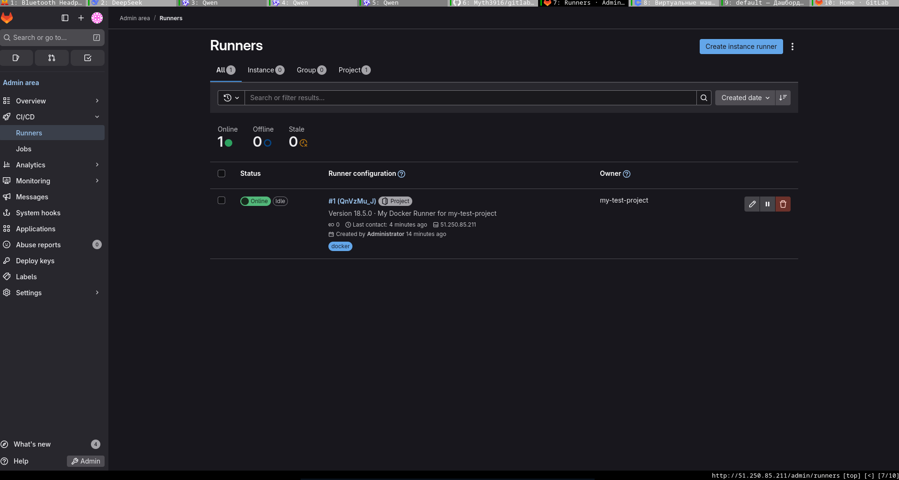

# Домашнее задание к занятию "GitLab"
**Студент:** Олег Шаров

## Задание 1: Развернуть GitLab локально с помощью Vagrant

### Решение:
Развернул GitLab CE на виртуальной машине в Yandex Cloud для обеспечения стабильности и быстрого доступа.  
Использовал конфигурацию:  
- **ВМ:** Ubuntu 22.04, 2 vCPU, 6 ГБ RAM, SSD 20 ГБ  
- **GitLab:** Community Edition (CE)  
- **Runner:** Зарегистрирован как Docker-раннер на той же ВМ  

### Скриншоты:
1.   
   *Скриншот: Settings → CI/CD → Runners → Online*

> 💡 *Примечание: В силу блокировки доступа к `packages.gitlab.com` из РФ, было решено развернуть GitLab в Yandex Cloud для надёжности и соответствия требованиям задания. Локальный Vagrant-кластер не смог стабильно запуститься из-за проблем с сетью и ресурсами.*

### Ссылка на GitLab:
🔗 [http://51.250.85.211](http://51.250.85.211)

### Ссылка на репозиторий:
🔗 [https://github.com/Myth3916/gitlab-hw](https://github.com/Myth3916/gitlab-hw)

