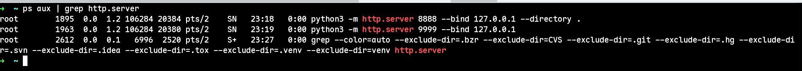
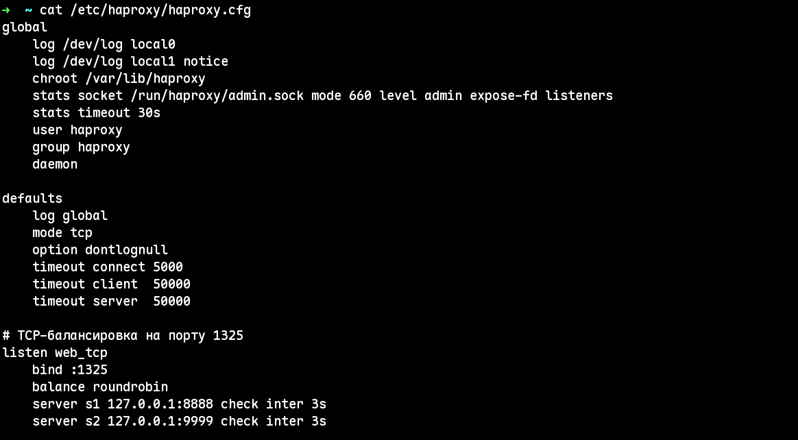
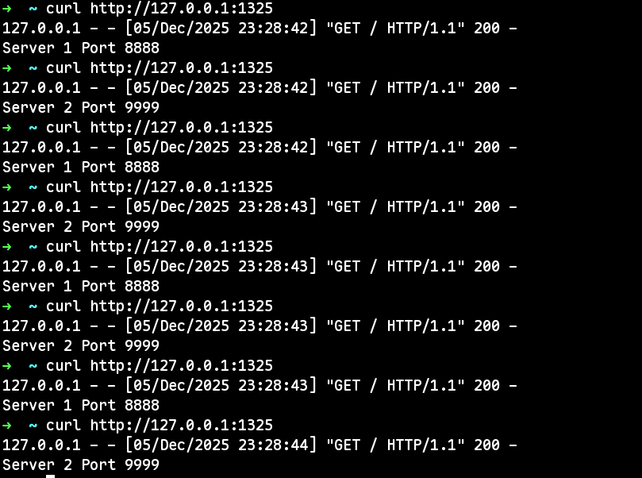
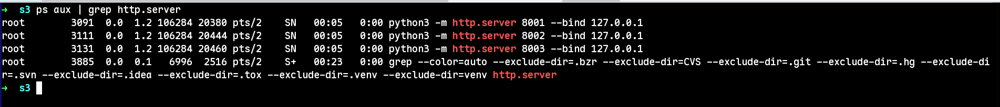

# Домашнее задание к занятию 2 «Кластеризация и балансировка нагрузки» — Шаров Олег

## Задание 1

Настроена балансировка с помощью HAProxy на **4-м уровне (L4/TCP)** с алгоритмом **roundrobin** между двумя простыми Python-серверами.

### Этапы выполнения

1. Созданы два HTML-файла в разных каталогах :
   - `index.html`:  
     ```text
     Server 1 Port 8888
     ```
   - `index.html`:  
     ```text
     Server 2 Port 9999
     ```

2. Запущены два Python-сервера каждый из своего каталога, там, где созданы файлы index.html:
   ```bash
   python3 -m http.server 8888 --bind 127.0.0.1 
   python3 -m http.server 9999 --bind 127.0.0.1 
   ```

3. Установлен и настроен HAProxy с балансировкой на порту `1325`.

4. Выполнена проверка: несколько `curl`-запросов к `http://127.0.0.1:1325` показывают чередование ответов от двух серверов.

### Конфигурационный файл HAProxy (`/etc/haproxy/haproxy.cfg`)

```cfg
global
    log /dev/log local0
    chroot /var/lib/haproxy
    user haproxy
    group haproxy
    daemon

defaults
    log global
    mode tcp
    option dontlognull
    timeout connect 5000
    timeout client  50000
    timeout server  50000

listen web_tcp
    bind :1325
    mode tcp
    balance roundrobin
    server s1 127.0.0.1:8888 check inter 3s
    server s2 127.0.0.1:9999 check inter 3s
```

### Скриншоты








## Задание 2

Настроена балансировка на **7-м уровне (HTTP)** с **Weighted Round Robin**, фильтрацией по домену `example.local` и отказом в обслуживании для других хостов.

### Этапы выполнения

1. Созданы три файла:
   - `/tmp/s1/index.html`: `Server A (weight 2)`
   - `/tmp/s2/index.html`: `Server B (weight 3)`
   - `/tmp/s3/index.html`: `Server C (weight 4)`
2. Запущены серверы на портах **8001**, **8002**, **8003**.
3. Настроен HAProxy на порту **8080**:
   - принимает только запросы с `Host: example.local`
   - применяет `balance roundrobin` с весами
   - возвращает **403 Forbidden** для любых других запросов
4. Добавлена запись в `/etc/hosts`:  
   ```text
   127.0.0.1 example.local
   ```

### Конфигурационный файл HAProxy (`/etc/haproxy/haproxy.cfg`)

```cfg
frontend http_front
    bind :8080
    acl is_example_local hdr(host) -i example.local
    use_backend web_servers if is_example_local
    http-request deny if !is_example_local

backend web_servers
    balance roundrobin
    server s1 127.0.0.1:8001 weight 2 check
    server s2 127.0.0.1:8002 weight 3 check
    server s3 127.0.0.1:8003 weight 4 check
```

### Скриншоты




