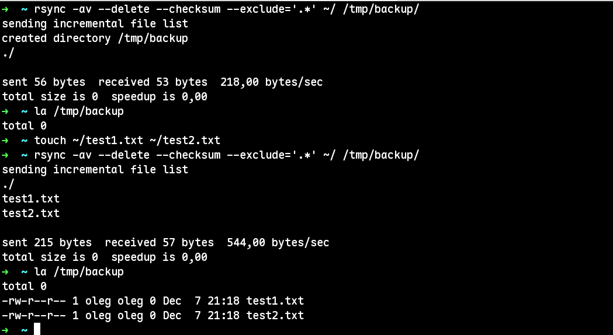
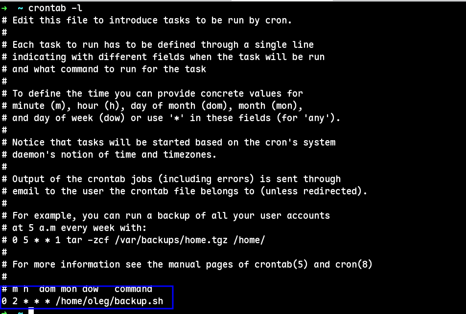
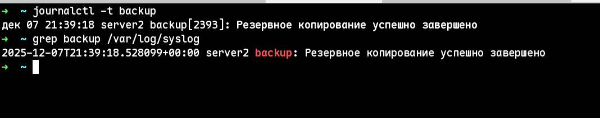

# Домашнее задание к занятию 3 «Резервное копирование» - Шаров Олег

## Задание 1

Команда `rsync` для создания зеркальной копии домашней директории в `/tmp/backup` с учётом всех требований:

```bash
rsync -av --delete --checksum --exclude='.*' ~/ /tmp/backup/
```

Пояснение флагов:

	 -a — архивный режим (рекурсивно, сохраняет атрибуты)
	 -v — подробный вывод
	 --delete — удаляет файлы в приёмнике, которых нет в источнике (зеркало)
	 --checksum — принудительно вычисляет хэш-суммы для сравнения
	 --exclude='.*' — исключает все скрытые файлы и директории

### Результат выполнения:




## Задание 2

#### Скрипт резервного копирования (`~/backup.sh`)

```bash
#!/bin/bash

BACKUP_DIR="/tmp/backup"
SOURCE="$HOME/"

rsync -a --delete --checksum --exclude='.*' "$SOURCE" "$BACKUP_DIR"

if [ $? -eq 0 ]; then
    logger -t backup "Резервное копирование успешно завершено"
else
    logger -t backup "Ошибка при резервном копировании"
fi
```

Настройка cron
Задание добавлено в пользовательский crontab:
```bash
crontab -e
```

Добавлена строка:

```bash
0 2 * * * /home/oleg/backup.sh
```

Это означает: запускать скрипт ежедневно в 2:00 утра.




Проверка логов
После запуска скрипта (вручную или через cron) в системном журнале появляется запись:




